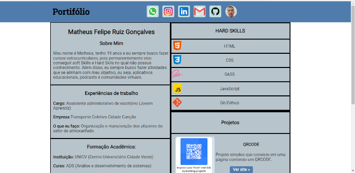

# Portfólio-Pessoal

## :memo: Descrição do Projeto

Projeto simples utilizando um sistema de GRID no CSS que apresenta meu portfólio pessoal e tudo aquilo que eu tenho conhecimento, além de minhas experiências profissionais e formação acadêmica. O projeto suporta se adapta para as seguintes resoluções de tela:

- 367 x 667 (Mobile)
- 1360 x 768 
- 1440 x 900

## [Acessar site](https://matheusfeliperuiz.github.io/Portifolio-Pessoal/)

##  Desenvolvido com: 

 <strong> HTML</strong>
 <strong>CSS</strong>

